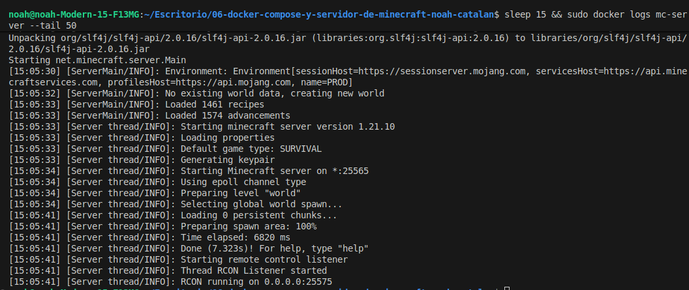

# Servidor de Minecraft con Docker Compose

**Autor:** Noah Catalán

## Descripción

Despliegue de un servidor de Minecraft Java Edition utilizando Docker Compose con la imagen `itzg/minecraft-server`.

## Proceso Realizado

1. Creación del archivo `docker-compose.yml` con configuración básica
2. Despliegue del servidor con `docker compose up -d`
3. Verificación del funcionamiento mediante logs
4. Otorgamiento de permisos de operador a usuario

## Configuración

- **Puerto:** 25565
- **Memoria RAM:** 2GB
- **Persistencia:** Volumen `mc-data`
- **EULA:** Aceptado

## Capturas




## Comandos Principales

```bash
# Iniciar servidor
sudo docker compose up -d

# Ver logs
sudo docker logs mc-server

# Dar permisos OP
sudo docker exec mc-server rcon-cli op <NOMBRE_USUARIO>

# Detener servidor
sudo docker compose down
```
